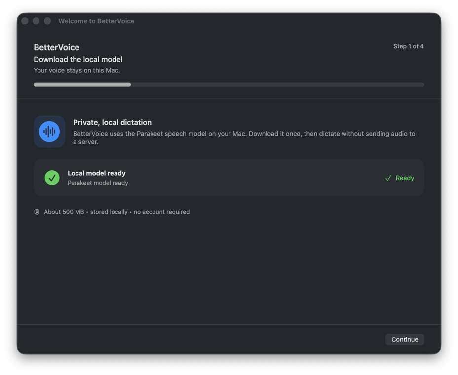

# BetterVoice

Voice dictation with the screen context you point at.

BetterVoice is an experimental, open-source macOS menu-bar app. It transcribes speech locally and captures the full screen whenever you circle something with your pointer, leaving a restrained blue highlight around the referenced area.



## Use it

- Hold `⌥` for a quick note. Recording starts after a short hold and finishes when you release.
- Press `⌘⌥` for a long explanation. Press it again to finish.
- A soft native sound confirms when listening starts and when it stops.
- While recording, circle any important UI with the pointer. A blue trail follows your movement and a pulse confirms each capture.
- BetterVoice inserts the transcript into the selected text field when macOS allows it, then copies the transcript and captured images to the clipboard.

Each circle captures the complete display beneath the pointer. Multiple circles produce screenshots in the same order you referenced them.

## Download

Download the latest Apple Silicon build from the [BetterVoice releases page](https://github.com/TarunTomar122/better-voice/releases/latest). Choose `BetterVoice-macos-arm64.zip`, unzip it, and open `BetterVoice.app`:

```sh
unzip BetterVoice-macos-arm64.zip
open BetterVoice.app
```

The release targets macOS 14+ on Apple Silicon. This experimental build is signed with an Apple Development certificate and is not notarized with a Developer ID certificate yet. On the first launch, macOS may require you to Control-click the app, choose **Open**, and confirm. If macOS still blocks it, use **System Settings → Privacy & Security → Open Anyway**. Then approve Microphone, Screen Recording, and Accessibility when BetterVoice asks. The local speech model downloads once (about 500 MB).

## Install from source

Requirements: macOS 14+, Swift 6/Xcode command-line tools, and a local Apple code-signing identity.

```sh
git clone https://github.com/TarunTomar122/better-voice.git
cd better-voice
./scripts/build-app.sh
```

The script builds, signs, and opens `.build/BetterVoice.app`. BetterVoice then walks through:

1. Microphone permission
2. Screen Recording permission
3. Accessibility permission for returning text to the selected field
4. The one-time local Parakeet model download (~500 MB)

Automatic microphone selection prefers a connected external input and falls back to the system input. You can choose a specific device from the menu bar.

To keep macOS permissions attached to the same identity across rebuilds, explicitly select your certificate when needed:

```sh
BETTERVOICE_SIGNING_IDENTITY="Apple Development: Your Name (TEAMID)" ./scripts/build-app.sh
```

## If something is not working

Open the menu-bar icon and choose **Getting Started…**. It shows the live state of the microphone, Screen Recording, Accessibility, selected input, and local model. Errors stay visible in a small recovery window with a path back to setup instead of disappearing as a system beep.

- **Shortcut does nothing:** enable **Accessibility**, confirm the local model says Ready, and make sure only one BetterVoice process is running. The build script closes the previous process before launching a rebuild.
- **No screenshot:** enable BetterVoice in **System Settings → Privacy & Security → Screen Recording**, then quit and reopen the app. The setup screen reads the current macOS permission every time; it does not cache an old answer.
- **Transcript is not inserted:** enable **Accessibility**. The transcript remains on the clipboard and in the saved session when the target app blocks direct insertion.
- **Wrong microphone:** choose the device under **Microphone** in the menu-bar menu.
- **Model download failed:** reopen **Getting Started…** and retry from the model row.
- **Accidental empty recording:** a session shorter than 2.5 seconds with no speech or circles is discarded quietly. Longer empty sessions are saved without opening an error dialog.

## Clipboard behavior

macOS lets one clipboard contain text, rich text, and image representations, but each destination decides which representation to accept. BetterVoice therefore attempts direct transcript insertion and also writes text plus separate PNG/TIFF image items to the clipboard. In attachment-aware editors, press `⌘V` once after recording to attach the images.

## Privacy and storage

- Transcription runs locally through [FluidAudio](https://github.com/FluidInference/FluidAudio).
- Temporary audio is deleted after transcription.
- Sessions live in `~/Desktop/BetterVoice` for at most 7 days.
- Saved sessions are capped at 500 MB, including during an active capture; the oldest are removed first.
- The local speech model is a separate one-time cache of roughly 500 MB.
- Recordings stop safely at 20 minutes, and abandoned temporary audio is removed on launch.
- Use **Open Saved Sessions** or **Clear Saved Sessions…** from the menu bar at any time.

A session contains:

```text
<timestamp>-<id>/
├── context.md
├── context-1.png
└── context-2.png
```

## Development

```sh
swift test -Xswiftc -strict-concurrency=complete
```

See [docs/ARCHITECTURE.md](docs/ARCHITECTURE.md) for the implementation map.

Current scope: English transcription, Apple Silicon macOS 14+, and an experimental downloadable release. The release is not notarized with a Developer ID certificate yet. Circle recognition is intentionally forgiving; you do not need to draw a perfect circle.

Inspired by the fluidity of Wispr Flow. BetterVoice is not affiliated with Wispr Flow.

If BetterVoice is useful, you can [buy me a coffee](https://buymeacoffee.com/taratdev) to support this and future experiments.
